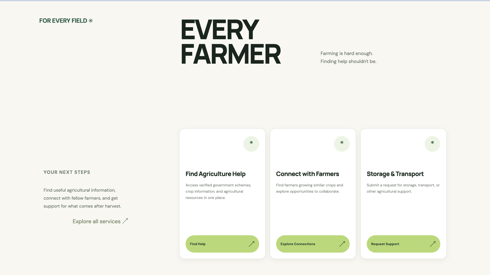
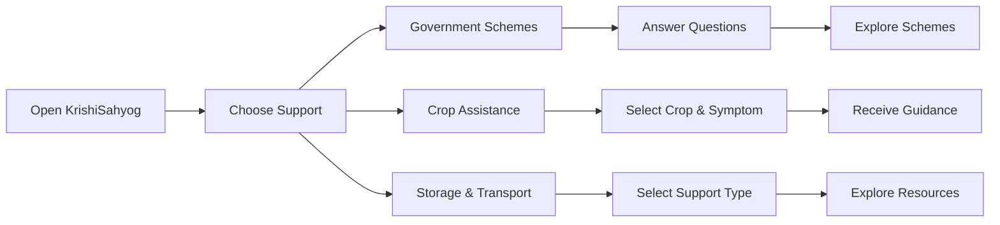
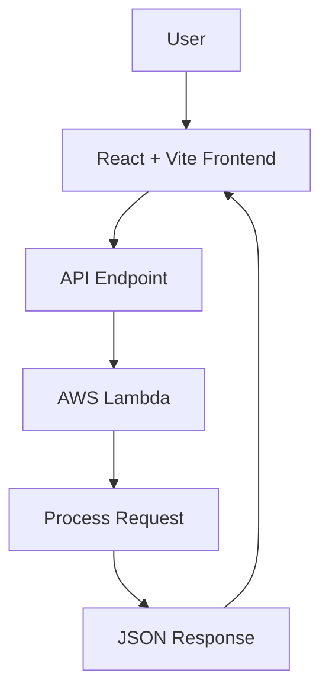

# 🌾 KrishiSahyog

### Making agricultural support easier to find, understand, and use.

KrishiSahyog is a farmer-focused platform that brings essential agricultural support into one simple experience.
It helps users explore government schemes, receive preliminary crop guidance, and discover storage and transportation resources.

---

## Project Preview

<!-- Add your screenshot here -->

---

## The Problem

Agricultural information is often scattered across multiple platforms.

Farmers may struggle to:

- Find relevant government schemes
- Understand available support
- Identify initial steps for crop problems
- Access storage and transportation resources

---

## Core Features

| Feature | Purpose |
|---|---|
| Government Scheme Discovery | Guided questions to explore potentially relevant schemes |
| Crop Assistance | Preliminary guidance based on crop symptoms |
| Storage & Transportation | Discover support for post-harvest needs |

---

## How It Works

---

## System Architecture

---

## Tech Stack

### Frontend

### Backend

### Development Tools

- VS Code
- Docker
- Git
- GitHub
- AWS SAM CLI

---

## AWS Integration

The backend is developed and tested locally using AWS SAM.

| Technology | Purpose |
|---|---|
| AWS Lambda | Serverless backend logic |
| AWS SAM | Define, build, and run the application locally |
| API Gateway | API routing through the SAM local environment |
| Docker | Local Lambda execution environment |

### Current API Endpoints

| Endpoint | Function |
|---|---|
| `/resources` | Agricultural resources |
| `/schemes` | Government scheme data |
| `/storage` | Storage-related information |
| `/crop-guidance` | Preliminary crop guidance |

---

## Design Approach

The interface focuses on:

- Clear navigation
- One-question-at-a-time interactions
- Reduced cognitive load
- Progressive disclosure
- Short, readable content
- Consistent visual hierarchy

The goal is to make agricultural support feel more approachable.

---

## Future Scope

Potential Improvements

- Verified and regularly updated scheme information
- Regional language support
- Expert-assisted crop guidance
- Database integration using DynamoDB
- File and image storage using S3
- Monitoring using CloudWatch
- More personalized recommendations

---

## Disclaimer

Crop guidance is preliminary and should not replace advice from qualified agricultural professionals.

Government scheme information should be verified through official sources before making decisions.

---
